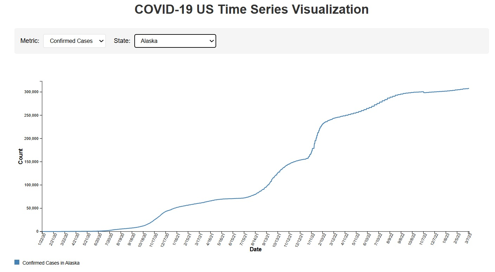

# COVID-19 US Data Visualization

## Overview
This interactive dashboard visualizes the cumulative time series data of COVID-19 for individual U.S. states.  

---

## Features

### Metric Selection
Users can toggle between metrics such as:
- **Confirmed Cases**
  

### State Dropdown
Select any U.S. state to view its specific case trend over time.

### Line Chart Visualization
Displays a cumulative count of the selected metric, plotted against time:
- **X-axis:** Timeline from 2020 to 2023  
- **Y-axis:** Cumulative count of cases or deaths

### Responsive and Clean UI
Built with **D3.js** for dynamic SVG rendering and smooth user interactions.

---

## Timeline Selection
The application features a powerful interactive timeline slider that allows users to:
- Select any portion of the pandemic timeline to analyze
- Create a fixed-width time window that can be moved along the timeline
- Compare equal time periods across different phases of the pandemic
- Visualize data changes over specific date ranges with precision
- Maintain the same time window length while sliding to different time periods
- Analyze trends during different waves or phases of the pandemic

This timeline functionality is implemented using **D3's brush component**, providing an intuitive way to explore how COVID-19 data evolved over time.  
The selected date range is prominently displayed above the visualization and reflected in the chart title.

---

## Requirements
The application runs entirely in the browser and requires:
- A modern web browser with JavaScript enabled
- Internet connection to load external libraries (D3.js)

---

## External Libraries
This application uses the following CDN-hosted library:
- **D3.js (v7.8.5)** – for data visualization and interactive components

---

## Data Files
- `confirmed_US.csv`: Time series data for confirmed cases in the U.S.
  

> Make sure these files are placed inside the `/data` subdirectory.

---

## Setup Instructions
1. Clone or download this repository
2. Place the required `.csv` data files into the `/data` folder
3. Open the `index.html` file in a modern web browser  
   *(No additional server setup is required — the application runs entirely in the browser)*

---

## How to Use

### 1. Choose a State
Use the **State** dropdown to select a specific U.S. state (e.g., Alaska).  
The chart will update to display time series data for that state.

### 2. Read the Chart
- The **X-axis** shows the timeline from early 2020 to 2023
- The **Y-axis** shows the cumulative count
- The **line** represents the progression of the selected metric over time

### 3. Use the Timeline Slider
- Drag to select a specific date range
- Move the selection window to view different phases
- Resize the selection to zoom in or out of time intervals

---
