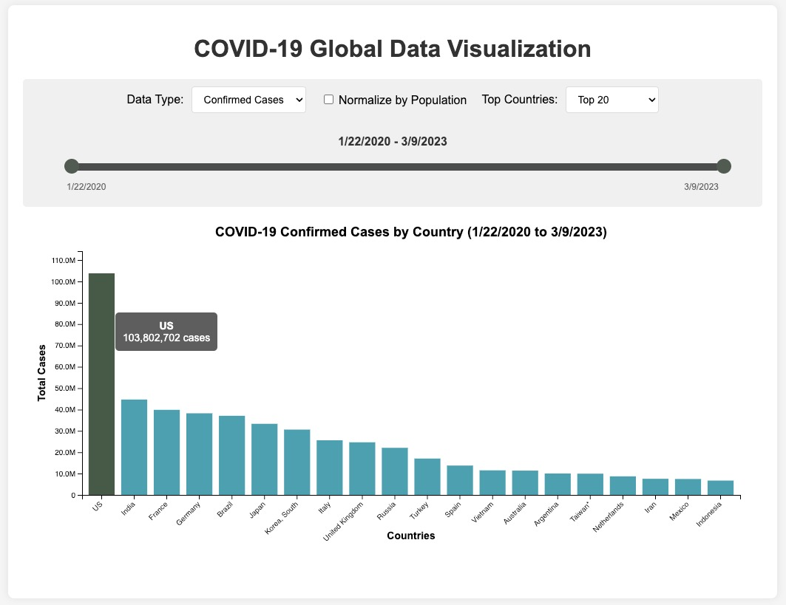

# COVID-19 Global Data Visualization

## Overview
This web application provides an interactive visualization of COVID-19 global data. It allows users to explore confirmed cases and deaths across countries, with options to normalize by population, filter by top countries, and select specific date ranges during the pandemic.

## Features
- Toggle between confirmed cases and death data
- Normalize data by population (per 100,000 people)
- Filter to view top 10, 20, 30 countries, or all countries
- Interactive timeline with brush functionality for flexible date range selection
- Responsive bar chart with tooltips showing detailed information
- Animated transitions when updating chart data

## Timeline Selection
The application features a powerful interactive timeline slider that allows users to:
- Select any portion of the pandemic timeline to analyze
- Create a fixed-width time window that can be moved along the timeline
- Compare equal time periods across different phases of the pandemic
- Visualize data changes over specific date ranges with precision
- Maintain the same time window length while sliding to different time periods
- Analyze trends during different waves or phases of the pandemic

This timeline functionality is implemented using D3's brush component, providing an intuitive way to explore how COVID-19 data evolved over time. The selected date range is prominently displayed above the visualization and reflected in the chart title.

## Demo

## Requirements
The application runs entirely in the browser and requires:
- A modern web browser with JavaScript enabled
- Internet connection to load external libraries (D3.js)

## External Libraries
This application uses the following CDN-hosted library:
- [D3.js](https://d3js.org/) (v7.8.5) - For data visualization and interactive components

## Data Files
The application expects the following CSV files in a `/data` directory:
1. `time_series_covid19_confirmed_global.csv` - Time series data for confirmed cases
2. `time_series_covid19_deaths_global.csv` - Time series data for deaths
3. `UID_ISO_FIPS_LookUp_Table.csv` - Contains population data for normalization

## Setup Instructions
1. Clone or download this repository
2. Ensure the data files are placed in a `/data` subdirectory
3. Open the HTML file in a web browser

## How to Use
1. Select "Confirmed Cases" or "Deaths" from the Data Type dropdown
2. Check "Normalize by Population" to view per capita data (per 100,000 people)
3. Choose how many countries to display using the Top Countries dropdown
4. Use the timeline slider to:
   - Click and drag to select a specific date range
   - Drag the entire selection to move the time window while maintaining its width
   - Drag either handle to resize the selection
5. Observe how the chart updates automatically when modifying the time range
6. Hover over bars to see detailed information for each country

## Browser Compatibility
- Chrome (recommended)
- Firefox
- Safari
- Edge

## Credits
- Data source: Johns Hopkins University CSSE